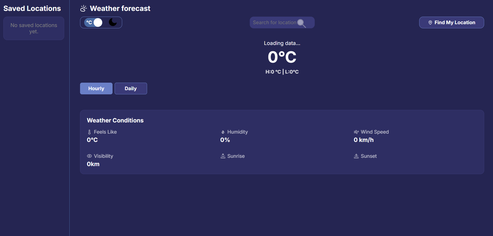
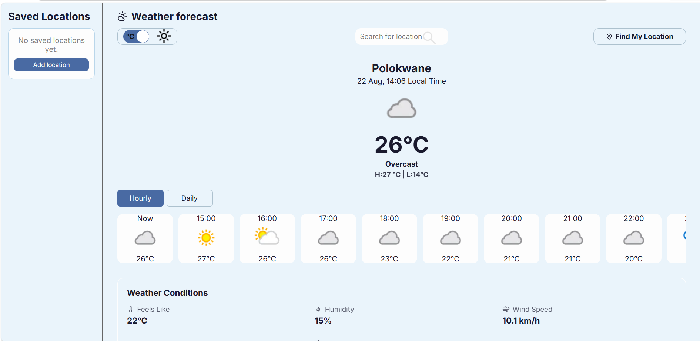

# Weather forecast App

A weather forecast web app built with React,Typescript and Vite.A user is able to search any location given that it exists for current weather condition for both hourly and daily forecast.They are able to save locations which will appear on the sidebar  for quick access also able to switch temperature units(°C or °F) and change theme based on their preference(dark and light mode).

[Live app](https://karabo-weather-forecast-app.netlify.app/)

## Features 
Retrieve current weather and 7 days forecast showing:
- temperature 
- humidity
- feels like temperature
- wind speed
- visibility
- sunrise time
- sunset time
- hourly forecast
- 7 days forecast
Location searching and My location button using browser geolocation.
 
Saved locations sidebar - can add searched location or dismiss it, when saved it shows the temperature and weather icon and switch between them with clicking.
 
Light and dark mode - Save user preference so that the mode is saved until they change it. You just click on the theme button then it changes.
 
Weather alerts for severe, extreme and moderate that stays in the browser. 
 
Privacy Notice - explains how the app handles data.

## Tech Stack
-React 

-Vite for dev server and building

-Axios for API request

-WeatherAPI.com for weather data

-Lucide React ,React Icons for icons

-React switch for theme toggle

## Installation 
## Clone the repository 
git clone https://github.com/Karabo-Merinah/Weather-App.git

## Navigate to project 
cd Weather-App
 
## Install dependencies 
npm install 
 
## Set up environment variables
 
Create a `.env` file in the project root and add your WeatherAPI.com key:
 
VITE_WEATHER_API_KEY=your_api_key_here
 
You can get a free API key by signing up at [WeatherAPI.com](https://www.weatherapi.com/).
 
## Start the development server
 
npm run dev 

## Deployment 
This project is deployed on Netlify.

## Preview

## Resources used 
- https://youtu.be/UjeXpct3p7M?si=WHVKIM1PR5yh55bn
- https://youtu.be/VzF2iTTc0MA?si=fjCnaz5dUyEesZMP
- https://youtu.be/_gKEUYarehE?si=5LOcYvhIYcGHwU-u
- https://youtu.be/s4CwrmwwSYg?si=tVkWRHCbLZRoHgg7
- https://youtu.be/pn3n9IFnV2I?si=H3VAeluH7QM_AcLz